# Clawd Pet

Animated pixel-art Clawd mascot SVGs for GitHub READMEs and profiles.

## Preview

| | | | |
|:---:|:---:|:---:|:---:|
| <br>happy | <br>sleeping | <br>idle | <br>thinking |
| <br>typing | <br>wizard | 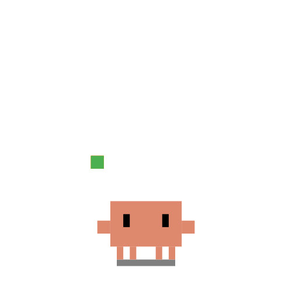<br>juggling | <br>conducting |
| <br>building | <br>carrying | <br>pushing | <br>sweeping |
| 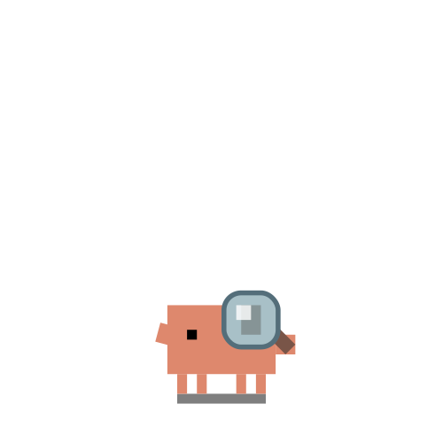<br>debugger | <br>confused | <br>overheated | <br>beacon |
| 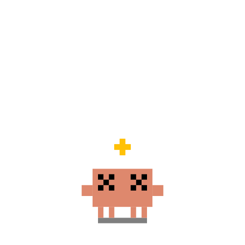<br>dizzy | <br>disconnected | <br>notification | <br>going away |
| <br>crab walking | 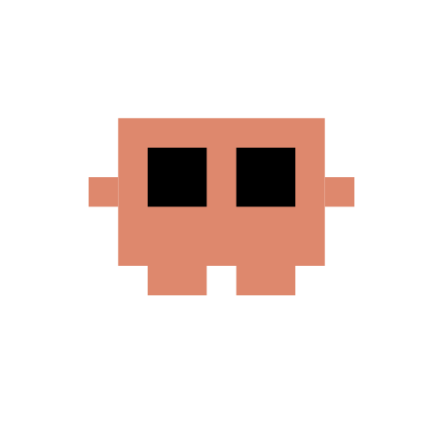<br>mini clawd | <br>mini crab | 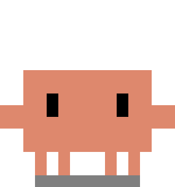<br>static |
| 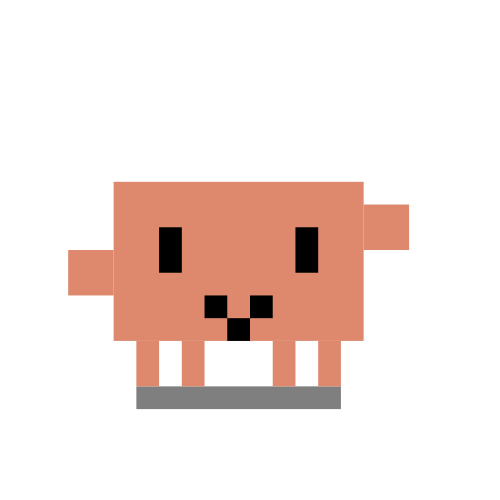<br>waving | <br>celebrating | <br>coffee | 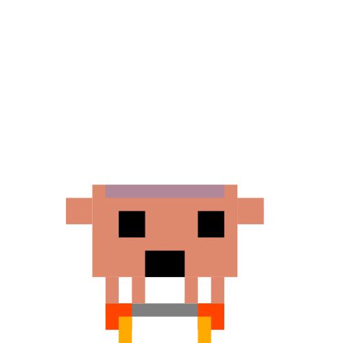<br>rocket |
| <br>error | 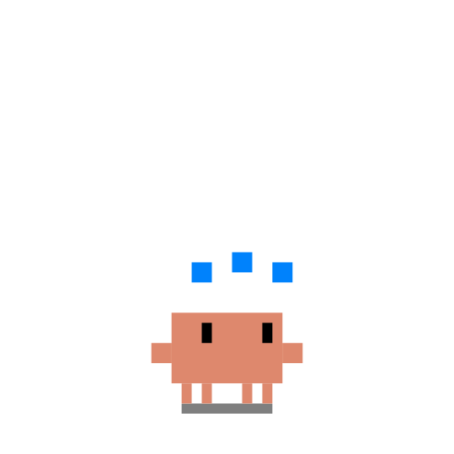<br>loading | <br>running | <br>meditating |
| 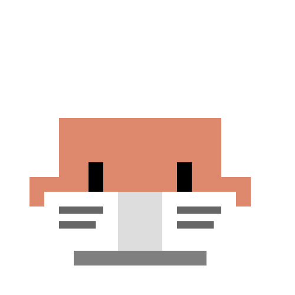<br>reading | <br>lifting | | |

## Usage

Reference the raw URL in your README:

```markdown

```

## Available variants

- `clawd-happy.svg` — Bouncing with sparkles and waving arms
- `clawd-sleeping.svg` — Splooted on the floor with floating Zzz's
- `clawd-idle-living.svg` — Idle breathing animation
- `clawd-working-thinking.svg` — Thinking with animated thought bubble
- `clawd-working-typing.svg` — Typing at keyboard
- `clawd-working-wizard.svg` — Casting spells
- `clawd-working-juggling.svg` — Juggling tasks
- `clawd-working-conducting.svg` — Conducting an orchestra
- `clawd-working-building.svg` — Building/constructing
- `clawd-working-carrying.svg` — Carrying heavy load
- `clawd-working-pushing.svg` — Pushing forward
- `clawd-working-sweeping.svg` — Sweeping/cleaning up
- `clawd-working-debugger.svg` — Debugging with magnifying glass
- `clawd-working-confused.svg` — Confused and lost
- `clawd-working-overheated.svg` — Overheating from hard work
- `clawd-working-beacon.svg` — Sending signals
- `clawd-dizzy.svg` — Dizzy and disoriented
- `clawd-disconnected.svg` — Connection lost
- `clawd-notification.svg` — Alert/notification
- `clawd-going-away.svg` — Walking away
- `clawd-crab-walking.svg` — Crab walking sideways
- `clawd-mini-clawd.svg` — Tiny version
- `mini-crab-typing.svg` — Mini crab at keyboard
- `clawd-static-base.svg` — Static pose (no animation)
- `clawd-waving.svg` — Friendly greeting wave
- `clawd-celebrating.svg` — Jumping with confetti (deploy success, PR merged)
- `clawd-coffee.svg` — Sipping coffee with steam
- `clawd-rocket.svg` — Launching with flames and stars
- `clawd-error.svg` — Panic mode with red flash and X eyes
- `clawd-loading.svg` — Waiting with orbiting dots
- `clawd-running.svg` — Sprinting with dust clouds
- `clawd-meditating.svg` — Zen floating with aura glow
- `clawd-reading.svg` — Reading a book with page flips
- `clawd-lifting.svg` — Lifting barbell with sweat drops

## License

MIT
