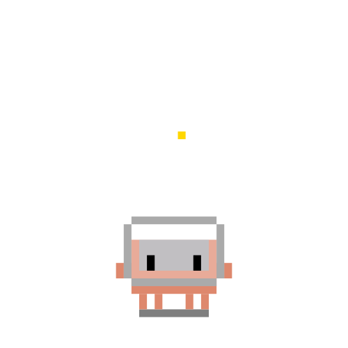
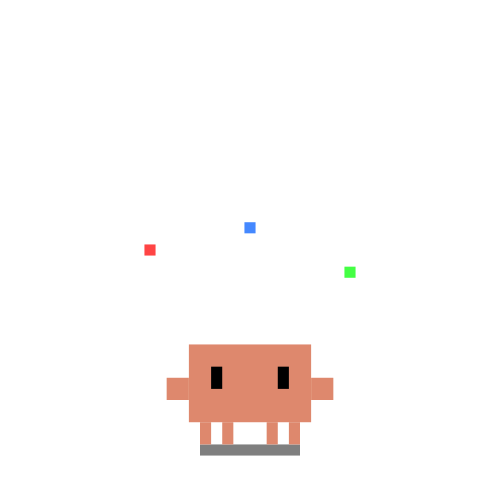
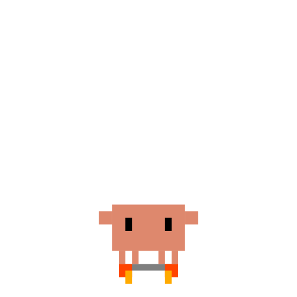

# Clawd Pets

90+ animated SVG pets with CSS-only motion — no JavaScript, no dependencies.

Browse, search, copy, and download them all from the interactive gallery built with Next.js.

<table>
<tr>
<td align="center"><br>happy</td>
<td align="center"><br>sleeping</td>
<td align="center"><br>coding</td>
<td align="center"><br>astronaut</td>
<td align="center"><br>ninja</td>
<td align="center"><br>dancing</td>
</tr>
<tr>
<td align="center"><br>typing</td>
<td align="center"><br>wizard</td>
<td align="center"><br>rocket</td>
<td align="center"><br>cool</td>
<td align="center"><br>love</td>
<td align="center"><br>celebrating</td>
</tr>
</table>

...and 78 more! See them all in the gallery.

## Gallery App

An interactive Next.js gallery to browse all Clawd pets:

- **Search** — filter pets by name in real-time
- **Categories** — Emotions, Activities, Working States, HTTP Status Codes
- **Click to copy** — copies the SVG code to your clipboard
- **Download** — grab any SVG file directly
- **Dark / Light mode** — toggle with the button in the top-right corner

### Run locally

```bash
npm install
npm run dev
```

Open [http://localhost:3000](http://localhost:3000).

### Tech stack

- [Next.js](https://nextjs.org) (App Router)
- [Tailwind CSS](https://tailwindcss.com) v4
- [Framer Motion](https://www.framer.com/motion/)
- TypeScript

## Use a pet

Embed any pet directly as an image:

```markdown

```

Or copy the SVG source from the gallery and inline it in your project for full animation support.

## Categories

| Category | Examples |
|----------|----------|
| Emotions | happy, angry, cool, love, crying, mindblown, shrug... |
| Activities | coding, dancing, gaming, surfing, yoga, ninja, pirate... |
| Working | typing, wizard, juggling, debugger, thinking, building... |
| HTTP Status | 400, 401, 403, 404, 408, 429, 500, 502, 503 |

## Request a pet

Need a Clawd pet that doesn't exist yet? [Open a pet request issue](https://github.com/abderrahimghazali/clawd-pet/issues/new?template=pet-request.yml) and describe what you'd like.

## License

MIT
