Animated pixel-art Clawd mascot SVGs for GitHub READMEs, profiles, and docs. Drop them anywhere with a single `` tag.

<table>
<tr>
<td align="center"><br>happy</td>
<td align="center"><br>sleeping</td>
<td align="center"><br>idle</td>
<td align="center"><br>thinking</td>
</tr>
<tr>
<td align="center"><br>typing</td>
<td align="center"><br>wizard</td>
<td align="center"><br>juggling</td>
<td align="center"><br>conducting</td>
</tr>
<tr>
<td align="center"><br>building</td>
<td align="center"><br>carrying</td>
<td align="center"><br>pushing</td>
<td align="center"><br>sweeping</td>
</tr>
<tr>
<td align="center"><br>debugger</td>
<td align="center"><br>confused</td>
<td align="center"><br>overheated</td>
<td align="center"><br>beacon</td>
</tr>
<tr>
<td align="center"><br>dizzy</td>
<td align="center"><br>disconnected</td>
<td align="center"><br>notification</td>
<td align="center"><br>going away</td>
</tr>
<tr>
<td align="center"><br>crab walking</td>
<td align="center"><br>static</td>
<td align="center"><br>waving</td>
<td align="center"><br>celebrating</td>
</tr>
<tr>
<td align="center"><br>coffee</td>
<td align="center"><br>rocket</td>
<td align="center"><br>error</td>
<td align="center"><br>loading</td>
</tr>
<tr>
<td align="center"><br>running</td>
<td align="center"><br>meditating</td>
<td align="center"><br>reading</td>
<td align="center"><br>lifting</td>
</tr>
<tr>
<td align="center"><br>coding</td>
<td align="center">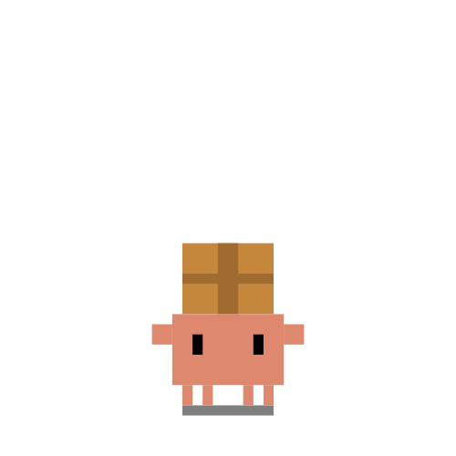<br>shipping</td>
<td align="center">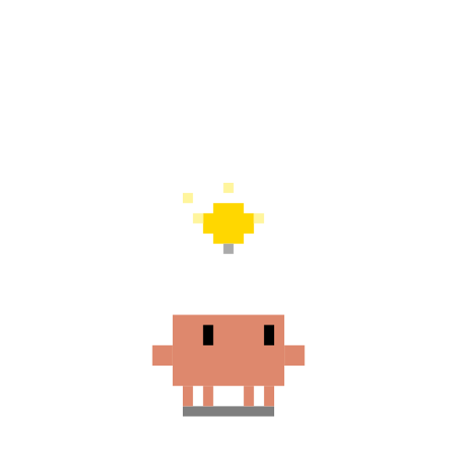<br>idea</td>
<td align="center"><br>love</td>
</tr>
<tr>
<td align="center">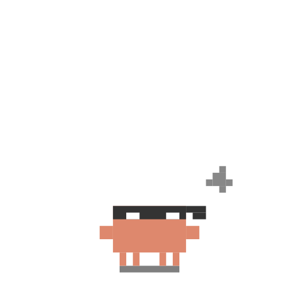<br>ninja</td>
<td align="center">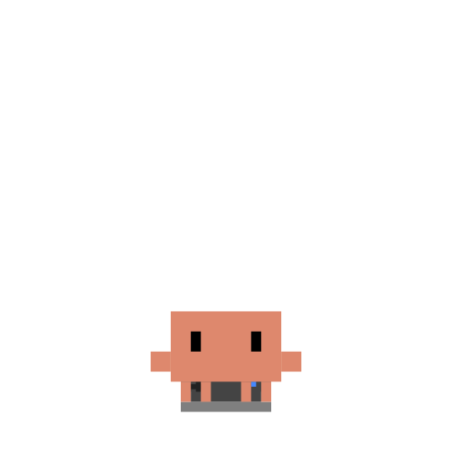<br>gaming</td>
<td align="center"><br>music</td>
<td align="center"><br>security</td>
</tr>
<tr>
<td align="center">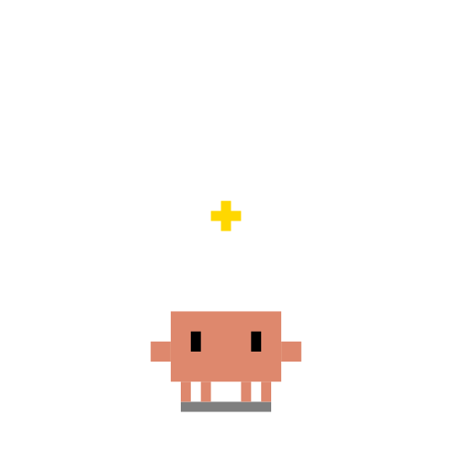<br>star</td>
<td align="center">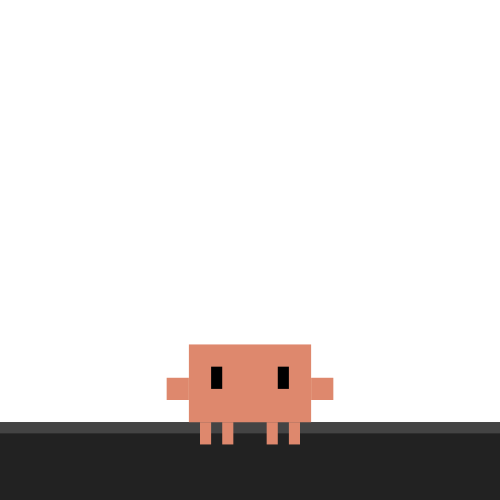<br>peeking</td>
<td align="center"><br>crying</td>
<td align="center"><br>eating</td>
</tr>
<tr>
<td align="center"><br>painting</td>
<td align="center">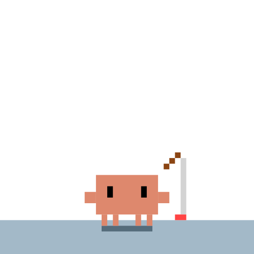<br>fishing</td>
<td align="center"><br>flying</td>
<td align="center">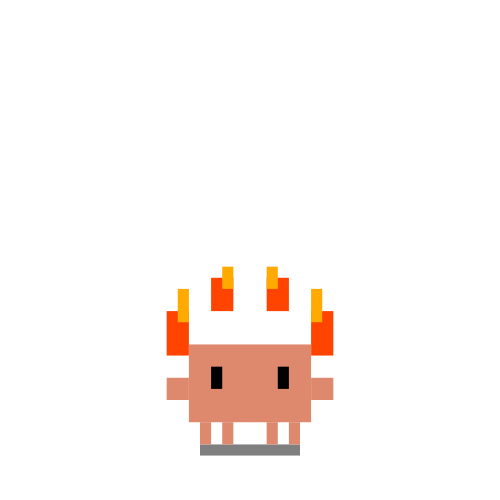<br>fire</td>
</tr>
<tr>
<td align="center">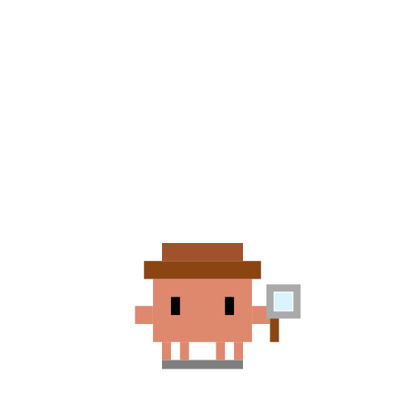<br>detective</td>
<td align="center"><br>chef</td>
<td align="center"><br>skateboard</td>
<td align="center">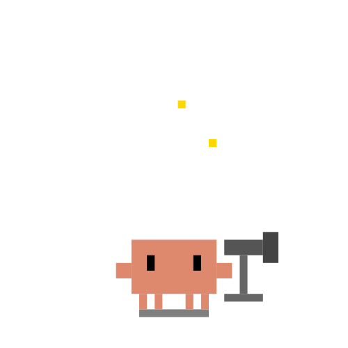<br>telescope</td>
</tr>
<tr>
<td align="center">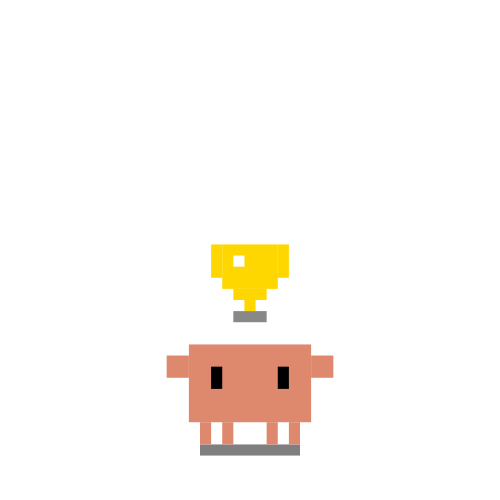<br>trophy</td>
<td align="center"><br>umbrella</td>
<td align="center"><br>snow</td>
<td align="center">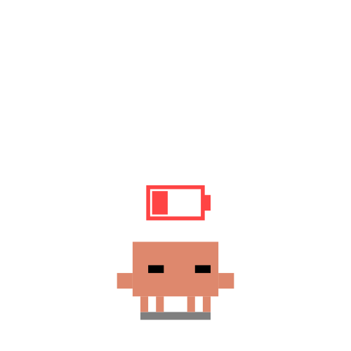<br>battery low</td>
</tr>
<tr>
<td align="center"><br>charging</td>
<td align="center"><br>gardening</td>
<td align="center">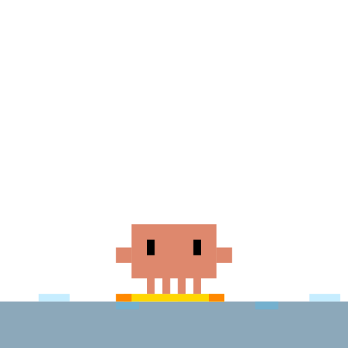<br>surfing</td>
<td align="center"><br>scared</td>
</tr>
</table>

## Usage

```markdown

```

## License

MIT
