# Clawd Pet

Animated pixel-art Clawd mascot SVGs for GitHub READMEs and profiles.

## Variants

| Thinking | Dancing | Happy | Mad | Sleeping |
|:--------:|:-------:|:-----:|:---:|:--------:|
|  |  |  |  |  |

## Usage

Reference the raw URL in your README:

```markdown

```

## Available variants

- `clawd-thinking.svg` — Contemplative sway with animated thought bubble
- `clawd-dancing.svg` — Bouncy dance with waving arms and music notes
- `clawd-happy.svg` — Jumping with sparkles, waving, and blushing
- `clawd-mad.svg` — Shaking with steam, raised fists, and angry face
- `clawd-sleeping.svg` — Gentle breathing with floating Zzz's

## License

MIT
